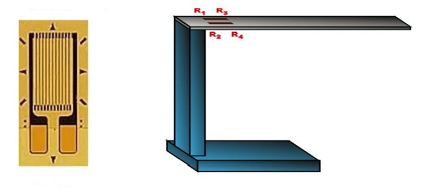

## Load cell
#### Theory : 
  A load cell is a transducer which converts force into a measurable electrical output. Although there are many varieties of load cells, strain gage based load cells are the most commonly used type.
Load cells are sensors that detect force (mass, torque, etc.).
When force is applied to a load cell, it converts the force into an electrical signal. Load cells are also known as "load transducers," because they convert a load (force) into electrical signals.
There are many different kinds of load cells.
-	Resistive load cells 
- 	Capacitive load cells 

Resistive load cells work on the principle of piezo-resistivity. When a load/force/stress is applied to the sensor, it changes its resistance. This change in resistance leads to a change in output voltage when a input voltage is applied.
Capacitive load cells work on the principle of change of capacitance which is the ability of a system to hold a certain amount of charge when a voltage is applied to it. For common parallel plate capacitors, the capacitance is directly proportional to the amount of overlap of the plates and the dielectric between the plates and inversely proportional to the gap between the plates.

#### Working Principle : 

A load cell is made by using an elastic member (with very highly repeatable deflection pattern) to which a number of strain gauges are attached.

In this particular load cell shown in above figure, there are a total of four strain gauges that are bonded to the upper and lower surfaces of the load cell.

When the load is applied to the body of a resistive load cell as shown above, the elastic member, deflects as shown and creates a strain at those locations due to the stress applied. As a result, two of the strain gauges are in compression, whereas the other two are in tension.
During a measurement, weight acts on the load cell’s metal spring element and causes elastic deformation.
This strain (positive or negative) is converted into an electrical signal by a strain gauge (SG) installed on the spring element. The simplest type of load cell is a bending beam with a strain gauge.
We use wheatstone bridge circuit to convert this change in strain/resistance into voltage which is proportional to the load.
##### Wheatstone Bridge :
The four strain gauges are configured in a Wheatstone Bridge configuration with four separate resistors connected as shown in what is called a Wheatstone Bridge Network.
An excitation voltage – usually 10V is applied to one set of corners and the voltage difference is measured between the other two corners. At equilibrium with no applied load, the voltage output is zero or very close to zero when the four resistors are closely matched in value. That is why it is referred to as a balanced bridge circuit.

When the metallic member to which the strain gauges are attached, is stressed by the application of a force, the resulting strain – leads to a change in resistance in one (or more) of the resistors. This change in resistance results in a change in output voltage. This small change in output voltage (usually about 20 mVolt of total change in response to full load) can be measured and digitized after careful amplification of the small milli-volt level signals to a higher amplitude 0-5V or 0-10V signal.
These load cells have been in use for many decades now, and can provide very accurate readings but require many tedious steps during the manufacturing process.
#### Uses :
The type of instruments used in the geotechnical field depends on the scope of work. Load cells can be used at the initial stage i.e. during the research and development or even at a later stage while monitoring a structure.
Geotechnical instruments are used both pre and post-construction to ensure the safety of structures, dams, tunnels, bridges, etc. Proper geotechnical monitoring ensures the long-term safety of these structures.
Load cells find their application in the geotechnical field and, they are commonly used to monitor:
- 	Deep foundations: excavation bracing like struts, soldier pile; tiebacks or anchors; retaining walls
- 	Tunnels and shafts: Steel liner plate, cast-in-place concrete, segmented precast concrete, shotcrete
- 	Dams: Concrete Dams, Underground Power House
- 	Piles: Pile load test.

#### Applictaions :
- 	 To determine the load in rock bolts, tiebacks, foundation anchors, cables or struts.
- 	Proof testing and long term performance monitoring of different kinds of anchor systems.
- 	Compressive load measurement between structural members i.e. tunnel supports or at the junction between a beam and the top of a pile strut.
- 	Used extensively for correlating data obtained from borehole extensometers.
- 	To determine the load in experimental research, pile testing and measurement of the thrust of rocks.
- 	Compressive load measurement between structural members.
- 	Measurement of compressive load and axial forces in struts.
- 	Load testing in piles.
- 	Determination of roof convergence in underground mines.

#### Advantages : 

- 	Load Cells have rugged & robust construction along with outstanding reliability and long term stability
- 	They are specially designed to suit the harsh & severe industrial environment.
- 	Load Cells are temperature compensated.
- 	They have a stable system with no moving parts and linkages.
- 	A few of them have multiple strain gages incorporated to reduce positioning effect.
- 	Any standard strain gage bridge measuring read-out device can be used with the load cells.
- 	The load cells have negligible side and eccentric load effect.

#### Limitations :

- 	It requires continuous electric energy for the production and display of signals.
- 	It also requires an amplification circuit for the generation of output display because the signals produced by the gauge itself are of very much low voltage almost in milli volts.
- 	It cannot be used for the pressure measurement of highly reactive or corrosive materials because they can damage the gauge.
- 	It cannot be used for the measurement of very high pressure if the diaphragm use is of plastic.

